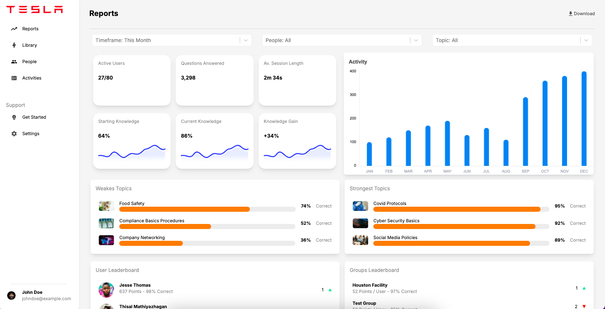

## Proje Hakkında
Nextjs, Tailwind ve chartjs kullanılarak hazırlanmış, raporların, kullanıcı ve ekiplerin puan tablosunun, makale istatistikleri ve daha fazlasının bulunduğu bir dashboard projesi.

Projede Nextjs, ui için Tailwind, grafikler için Chartjs gibi teknolojiler kullanıldı. Veriler için Nextjs api'si kullanıldı.



## Kurulum
- npm'in kurulu olduğunu varsayarak, projeyi bilgisayarınıza alın;
```bash
  git clone https://github.com/busradogann/tesla-dashboard.git
```

- Proje dizinine gidin;
```bash
  cd tesla-dashboard
```

- Bağımlılıkları indirin;
```bash
  npm install
```

- Ardından aşağıdaki komutla projeyi çalıştırın;
```bash
  npm run dev
```

## Not
- Node.js versiyon: Node.js'nin uyumlu bir sürümünü (tercihen 16.x veya üstü) kullandığınızdan emin olun.
- Next.js versiyon: Proje Next.js 14.2.5 sürümüyle oluşturulmuştur.
